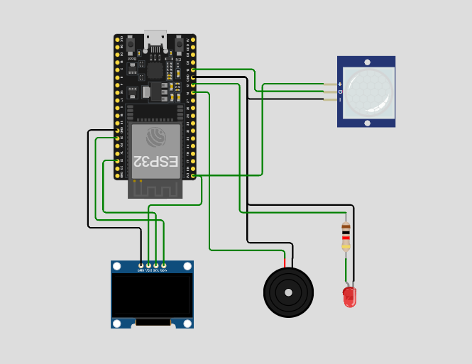

# 🚨 Motion Detector with ESP32, PIR Sensor, OLED & Buzzer

This project simulates a basic motion detector system using:
- ESP32 microcontroller
- PIR motion sensor
- OLED display (0.96")
- Buzzer and LED

It uses Wokwi for simulation — no hardware required!

---

## 🔗 Try the Simulation

👉 [Click here to open in Wokwi](https://wokwi.com/projects/434887944459247617)

---

## 🖼️ Circuit Diagram

---

